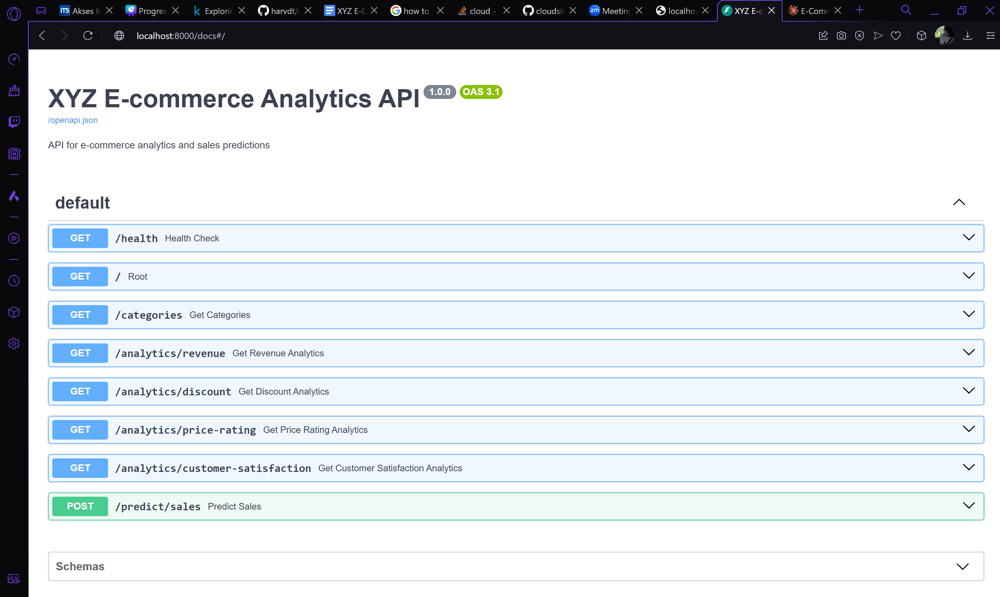

# XYZ E-Commerce Data Lake House

Proyek ini merupakan implementasi data lakehouse untuk menganalisis data penjualan dari platform e-commerce XYZ menggunakan arsitektur mediated dan teknologi Delta Lake.

## Anggota Kelompok 5

| Nama                            | NRP        |
| ------------------------------- | ---------- |
| Samuel Yuma Krismata            | 5027221029 |
| Muhammad Harvian Dito Syahputra | 5027221039 |
| Hafiz Akmaldi Santosa           | 5027221061 |
| Nur Azka Rahadiansyah           | 5027221064 |
| Naufan Zaki Luqmanulhakim       | 5027221065 |

## Deskripsi Proyek

Proyek ini bertujuan untuk membangun sistem analisis data e-commerce yang dilengkapi dengan machine learning untuk memprediksi penjualan. Sistem ini mengintegrasikan berbagai metrik untuk memberikan wawasan komprehensif tentang performa bisnis.

## Setup Development Environment

1. Instal Python 3.11

```bash
bash scripts/python.sh
```

2. Jalankan pipeline

```bash
bash run.sh
```

3. Simulasi pemrosesan data secara real-time (jalankan setelah selesai memproses 2 dataset yang tersedia)

```bash
bash scripts/simulation.sh 1|2|all
```

API akan tersedia di `http://localhost:8000` dengan dokumentasi Swagger UI di `/docs`.


## API Endpoints

### 1. Health Check

```bash
GET /health
```

Mengecek status API.

-   Response: Status dan timestamp server

### 2. Prediksi Penjualan

```bash
POST /predict/sales
```

Memprediksi jumlah penjualan berdasarkan parameter produk.

**Request Body:**

```json
{
	"price": 299.99, // Harga produk
	"discount_percentage": 15, // Persentase diskon (0-100)
	"rating": 4.5, // Rating produk (1-5)
	"num_reviews": 100, // Jumlah review
	"category": "ELECTRONICS" // Kategori produk
}
```

**Response:**

```json
{
	"predicted_sales": 10046.66, // Prediksi jumlah penjualan
	"confidence_score": 0.9832 // Skor kepercayaan prediksi (0-1)
}
```

### 3. Analisis Performa Penjualan

```bash
GET /analytics/revenue
GET /analytics/revenue?category=ELECTRONICS
```

Menampilkan analisis revenue per kategori.

### 4. Analisis Diskon

```bash
GET /analytics/discount
GET /analytics/discount?category=ELECTRONICS
```

Menampilkan efektivitas diskon dan dampaknya terhadap volume penjualan.

### 5. Analisis Harga-Rating

```bash
GET /analytics/price-rating
GET /analytics/price-rating?category=ELECTRONICS
```

Menampilkan korelasi antara harga dan rating produk.

### 6. Metrik Kepuasan Pelanggan

```bash
GET /analytics/customer-satisfaction
GET /analytics/customer-satisfaction?category=ELECTRONICS
```

Menampilkan metrik kepuasan pelanggan dan rasio review terhadap penjualan.

### 7. Daftar Kategori

```bash
GET /categories
```

Menampilkan seluruh kategori produk yang tersedia.

## Penggunaan API untuk Frontend

### Contoh Penggunaan dengan JavaScript/React

```javascript
// Fungsi untuk mendapatkan prediksi penjualan
const getPredictionSales = async (productData) => {
	const response = await fetch("http://localhost:8000/predict/sales", {
		method: "POST",
		headers: {
			"Content-Type": "application/json",
		},
		body: JSON.stringify({
			price: productData.price,
			discount_percentage: productData.discount,
			rating: productData.rating,
			num_reviews: productData.reviews,
			category: productData.category,
		}),
	});

	const data = await response.json();
	return {
		predictedSales: data.predicted_sales,
		confidence: data.confidence_score,
	};
};

// Fungsi untuk mendapatkan analisis kategori
const getCategoryAnalytics = async (category) => {
	const endpoints = ["revenue", "discount", "price-rating", "customer-satisfaction"];

	const analytics = {};

	for (const endpoint of endpoints) {
		const url = category ? `http://localhost:8000/analytics/${endpoint}?category=${category}` : `http://localhost:8000/analytics/${endpoint}`;

		const response = await fetch(url);
		analytics[endpoint] = await response.json();
	}

	return analytics;
};
```

## Notes untuk Pengembang Frontend

1. **Model Confidence Score**

    - Score > 0.9: Prediksi sangat akurat
    - Score 0.7-0.9: Prediksi cukup akurat
    - Score < 0.7: Prediksi kurang akurat

2. **Batasan Input**

    - Price: Harus positif
    - Discount: 0-100%
    - Rating: 1-5
    - Reviews: Harus positif
    - Category: Harus sesuai dengan daftar kategori yang tersedia

3. **Error Handling**

    - Selalu periksa status response
    - Implementasikan retry mechanism untuk kegagalan network
    - Tampilkan pesan error yang user-friendly

4. **Performa**
    - Implementasikan caching untuk data analitik
    - Batasi frekuensi request prediksi
    - Gunakan loading state untuk request yang sedang berjalan
