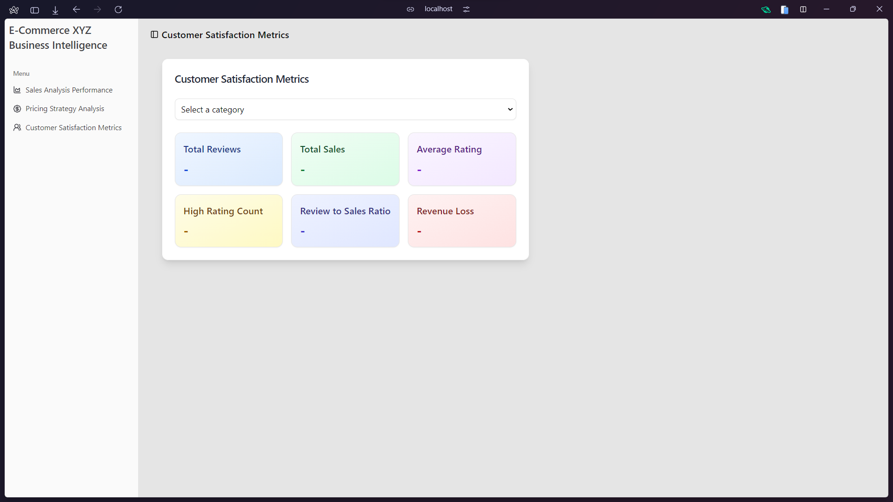

# XYZ E-Commerce Data Lake House

Implementasi data lakehouse real-time untuk analisis e-commerce menggunakan arsitektur mediasi dan teknologi Delta Lake, dilengkapi dengan kemampuan machine learning terintegrasi.

## Anggota Tim - Kelompok 5

| Nama                            | NRP        |
| ------------------------------- | ---------- |
| Samuel Yuma Krismata            | 5027221029 |
| Muhammad Harvian Dito Syahputra | 5027221039 |
| Hafiz Akmaldi Santosa           | 5027221061 |
| Nur Azka Rahadiansyah           | 5027221064 |
| Naufan Zaki Luqmanulhakim       | 5027221065 |

## Arsitektur Teknis

### Gambaran Sistem


Sistem mengimplementasikan arsitektur data lakehouse multi-layer dengan:
- Pengambilan data real-time menggunakan Kafka
- Delta Lake untuk kepatuhan ACID
- PySpark untuk pemrosesan terdistribusi
- Machine learning dengan scikit-learn
- FastAPI untuk endpoint REST
- Frontend React untuk visualisasi

### Alur Data


## Komponen Teknis

### 1. Layer Integrasi Data

#### Komponen Producer (`producer.py`)
- Mengimplementasikan `FileSystemEventHandler` untuk monitoring file real-time
- Memproses file CSV di direktori data mentah
- Mengubah data ke format JSON
- Mempublikasikan ke topik Kafka 'kafka-server'
- Fitur konversi dan validasi tipe data otomatis

#### Komponen Consumer (`consumer.py`)
- Berlangganan ke topik Kafka 'kafka-server'
- Mengimplementasikan pemrosesan batch (ukuran batch: 100)
- Menggunakan Delta Lake untuk penulisan yang patuh ACID
- Mempertahankan timestamp pemrosesan
- Memicu pipeline pemrosesan data setelah penulisan batch berhasil

### 2. Pipeline Pemrosesan Data

#### Layer Bronze
- Pengambilan data mentah dengan validasi skema
- Definisi skema:
```python
bronze_schema = StructType([
    StructField("ProductID", IntegerType(), True),
    StructField("ProductName", StringType(), True),
    # ... field tambahan
])
```

#### Layer Silver (`bronze_to_silver_processing.py`)
- Pembersihan dan standardisasi data
- Rekayasa fitur
- Menerapkan aturan validasi:
  - Rentang harga: 0-500
  - Rentang rating: 1-5
  - Validasi jumlah review
  - Pemformatan tanggal
  - Standardisasi kategori

#### Layer Gold (`silver_to_gold_processing.py`)
- Perhitungan metrik bisnis
- Pembuatan tampilan analitis
- Metrik utama meliputi:
  - Analisis pendapatan
  - Efektivitas diskon
  - Korelasi harga-rating
  - Metrik kepuasan pelanggan

### 3. Sistem Machine Learning

#### Arsitektur Model
- Model ensemble bertumpuk yang menggabungkan:
  - Random Forest Regressor
  - Gradient Boosting Regressor
  - XGBoost Regressor
- Pipeline rekayasa fitur dengan standardisasi
- Validasi silang (k=5)

#### Opsi Pelatihan

1. Mode Berkelanjutan (`training_coordinator.py`)
```python
# Fitur:
- Deteksi perubahan data real-time
- Pemicu pelatihan cerdas
- Manajemen state
- Pencatatan metrik kinerja
```

2. Mode Terjadwal
```bash
# Konfigurasi Crontab untuk pelatihan terjadwal
*/5 * * * * /path/to/project/scripts/run_training.sh
```

#### Metrik Kinerja Model
- Skor R²: 0.9832
- RMSE: 70.8580
- MAE: 60.7211
- Pelacakan Kepentingan Fitur

### 4. Layer API (`main.py`)

Implementasi FastAPI dengan endpoint:

```python
@app.post("/predict/sales")
async def predict_sales(request: PredictionRequest):
    # Endpoint prediksi penjualan
    # Validasi dan pemrosesan input
    # Inferensi model
    # Penilaian kepercayaan
```

Endpoint tambahan:
- Analitik pendapatan
- Analisis diskon
- Korelasi harga-rating
- Metrik kepuasan pelanggan

### 5. Implementasi Frontend

#### Dashboard Analisis Penjualan

- Visualisasi data real-time
- Antarmuka prediksi penjualan
- Metrik kinerja per kategori

#### Antarmuka Strategi Harga

- Analisis dampak diskon
- Visualisasi korelasi harga-rating
- Alat optimasi pendapatan

#### Dashboard Metrik Pelanggan

- Visualisasi metrik kepuasan
- Alat analisis ulasan
- Pelacakan keterlibatan

## Pengaturan dan Deployment

### 1. Pengaturan Lingkungan
```bash
# Instal Python 3.11
bash scripts/python.sh

### 2. Inisialisasi Pipeline
```bash
# Mulai pipeline data
bash run.sh

# Mulai pelatihan model (pilih salah satu):
# Opsi 1: Mode Berkelanjutan
python3 src/models/training/training_coordinator.py

# Opsi 2: Mode Terjadwal
crontab -e
# Tambahkan: */5 * * * * /path/to/project/scripts/run_training.sh
```

### 3. Simulasi Data Real-time
```bash
bash scripts/simulation.sh [1|2|all]
```

### 4. Akses API
- URL Dasar: `http://localhost:8000`
- Dokumentasi Swagger: `/docs`
- Spesifikasi OpenAPI: `/openapi.json`

## Spesifikasi Teknis

### Persyaratan Sistem
- Python 3.11+
- Apache Kafka
- Delta Lake
- PySpark
- Node.js (untuk frontend)

### Dependensi
```
pyspark==3.5.0
delta-spark==3.0.0
scikit-learn==1.3.2
xgboost==2.0.3
fastapi==0.108.0
```

### Pertimbangan Kinerja
- Optimasi ukuran batch untuk consumer Kafka
- Optimasi Delta Lake untuk operasi penulisan
- Penyesuaian frekuensi pelatihan ulang model
- Pembatasan rate request API

## Dokumentasi API

API REST komprehensif dengan endpoint berikut:

### Endpoint Prediksi
```json
POST /predict/sales
{
    "price": 299.99,
    "discount_percentage": 15,
    "rating": 4.5,
    "num_reviews": 100,
    "category": "ELECTRONICS"
}
```

### Endpoint Analitik
```bash
GET /analytics/revenue
GET /analytics/discount
GET /analytics/price-rating
GET /analytics/customer-satisfaction
```

Setiap endpoint mendukung penyaringan kategori opsional.

## Catatan Pengembangan

### Pipeline Machine Learning
- Pemantauan kepentingan fitur
- Pelacakan kinerja model
- Pemicu pelatihan ulang otomatis
- Persistensi state

### Panduan Pengembangan Frontend
- Struktur komponen React
- Penggunaan komponen ShadCN
- Implementasi Tailwind CSS
- Integrasi Chart.js

### Penanganan Error
- Degradasi bertahap
- Mekanisme percobaan ulang request
- Pesan error yang ramah pengguna
- Pencatatan dan pemantauan